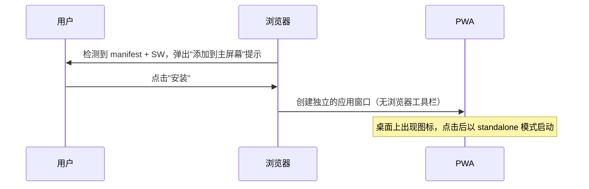
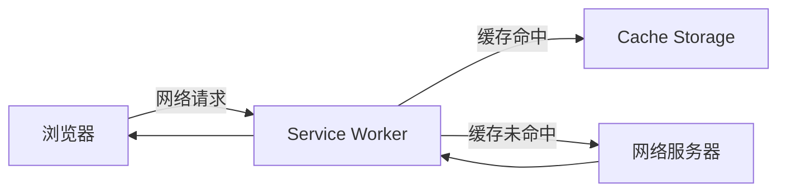
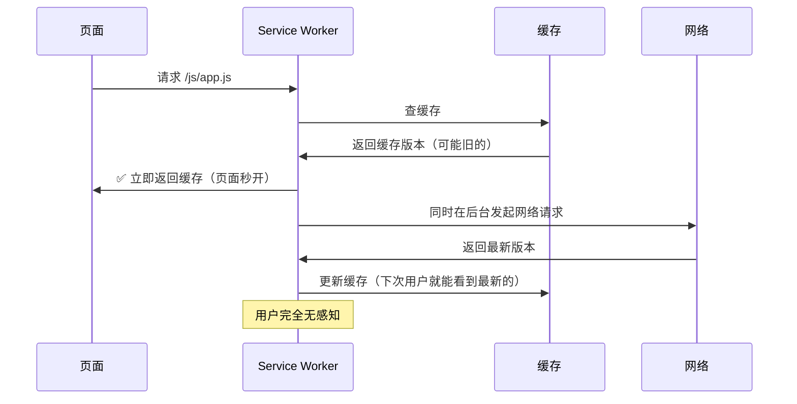
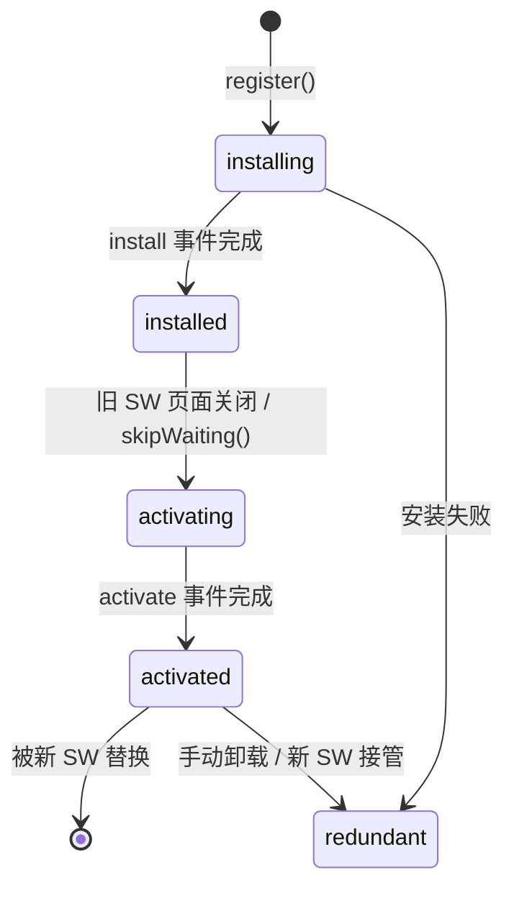
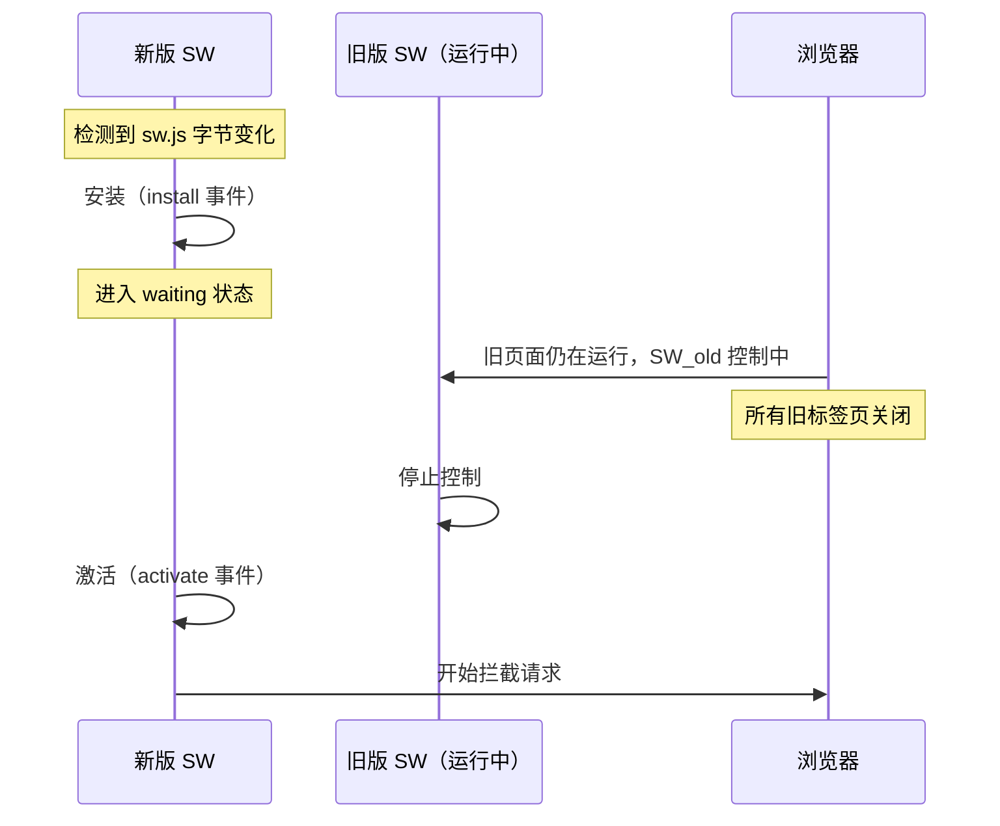
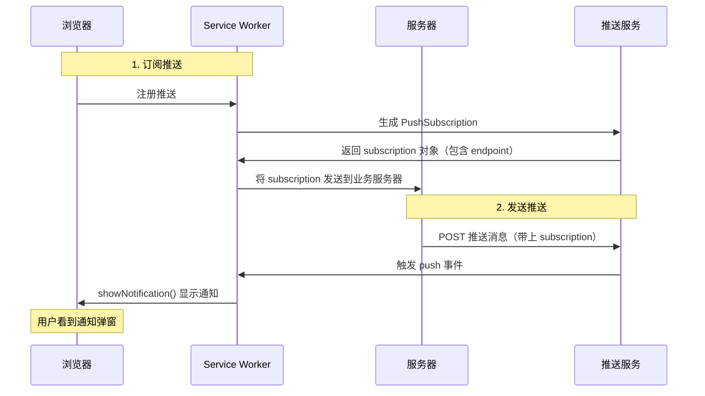

## 目录

1. [开篇：PWA 到底是啥？](#开篇pwa-到底是啥)
2. [PWA 概览：核心技术一图看懂](#pwa-概览核心技术一图看懂)
3. [Web App Manifest：把网站变成"可安装的 App"](#web-app-manifest把网站变成可安装的-app)
4. [Service Worker：浏览器背后的隐形代理](#service-worker浏览器背后的隐形代理)
5. [Cache Storage + Service Worker：离线缓存的实战模式](#cache-storage--service-worker离线缓存的实战模式)
6. [Service Worker 的生命周期详解](#service-worker-的生命周期详解)
7. [Workbox：生产环境的最佳实践](#workbox生产环境的最佳实践)
8. [消息推送（Web Push）](#消息推送web-push)
9. [PWA 面试高频问题](#pwa-面试高频问题)
10. [总结回顾](#总结回顾)

---

<!-- more -->

## 开篇：PWA 到底是啥？

想象你去一家餐厅吃饭：

1. **不用下载 App**（渐进式）——你扫码就能看到电子菜单，不用先装一个"点餐 App"
2. **没网也能看菜单**（离线能力）——你提前打开了菜单，在地下室也能翻看
3. **能收到推送**（消息通知）——"您的餐已备好"会弹到你的手机通知栏
4. **可以放到桌面**（可安装）——你觉得这家店不错，把它的网页"存"到手机桌面，下次像 App 一样一点就开

这就是 **PWA（Progressive Web Application，渐进式网页应用）**——把 Web 的"随手可得"和 Native App 的"好用能力"结合在一起。

**PWA 不是一门新技术，而是一组技术的组合**，核心有三：

| 技术 | 作用 | 类比 |
|------|------|------|
| **Web App Manifest** | 让网页可安装到桌面 | 给网页一个"身份证" |
| **Service Worker** | 离线缓存 + 消息推送 + 网络代理 | 浏览器背后的"隐形管家" |
| **Web Push** | 服务器向用户推送通知 | 餐厅服务员来通知你 |

> ❗ 面试常问：**PWA 和 Native App 相比的优缺点？**
> ✅ 优点：无需安装、即时更新、可被搜索引擎索引、跨平台、体积极小
> ❌ 缺点：无法访问部分原生 API（蓝牙、NFC 等）、iOS 支持有限、后台保活能力弱于原生

---

## PWA 概览：核心技术一图看懂

```
用户操作          PWA 能力          实现技术
──────────────────────────────────────────
打开网页  ───→  可以离线浏览    ───→  Service Worker + Cache Storage
添加到桌面 ───→  像 App 一样启动 ───→  Web App Manifest
推送通知  ───→  消息弹窗提醒    ───→  Web Push API + Service Worker
页面秒开  ───→  缓存优先加载    ───→  Service Worker 策略
```

PWA 的核心门槛是 **HTTPS**——Service Worker 只能在 HTTPS 下工作（本地调试的 localhost 除外）。没有 HTTPS，PWA 一切免谈。

---

## Web App Manifest：把网站变成"可安装的 App"

### 什么是 Manifest

`manifest.json` 是一个 JSON 文件，告诉浏览器：这个网站可以像一个原生应用一样被"安装"到用户设备上。

```html
<!-- 在 HTML 中引用 -->
<link rel="manifest" href="/manifest.json">
```

### 核心字段

```json
{
  "name": "我的应用",
  "short_name": "我的应用",
  "description": "这是一个 PWA 示例应用",
  "start_url": "/",
  "display": "standalone",
  "background_color": "#ffffff",
  "theme_color": "#3f51b5",
  "icons": [
    {
      "src": "/icons/icon-192x192.png",
      "sizes": "192x192",
      "type": "image/png"
    },
    {
      "src": "/icons/icon-512x512.png",
      "sizes": "512x512",
      "type": "image/png"
    }
  ]
}
```

| 字段 | 说明 | 面试频率 |
|------|------|---------|
| `start_url` | 从桌面图标打开时显示的页面 | ⭐⭐ |
| `display` | 显示模式：`standalone`（无浏览器栏，像 App）、`fullscreen`、`minimal-ui`、`browser` | ⭐⭐⭐ |
| `background_color` | 启动时的背景色（在 Splash 屏显示） | ⭐ |
| `theme_color` | 浏览器地址栏、任务栏的颜色 | ⭐ |
| `icons` | 各分辨率的应用图标，至少 192x192 和 512x512 | ⭐⭐ |
| `scope` | 哪些路径在 PWA 范围内，超出则用浏览器打开 | ⭐⭐ |

> ❗ 面试题：**PWA 的可安装条件是什么？**
> 1. 有 `manifest.json`（包含 `name` 或 `short_name`、`icons`、`start_url`、`display`）
> 2. 注册了 Service Worker
> 3. 使用 HTTPS
> 4. 用户有交互行为（不能一打开页面就弹安装提示）

### 安装到桌面的流程



---

## Service Worker：浏览器背后的隐形代理

### 什么是 Service Worker

**Service Worker（简称 SW）** 是浏览器在后台独立运行的一个脚本，本质是一个 **Web Worker**，但它比普通 Web Worker 多了拦截网络请求和离线缓存的能力。



> **通俗理解**：Service Worker 像一个"交通警察"站在浏览器和网络之间——它可以决定"这个请求走缓存"还是"这个请求走网络"。

### 与 Web Worker 的区别

| 特性 | Web Worker | Service Worker |
|------|-----------|---------------|
| 目的 | 多线程计算 | 网络代理 + 离线缓存 |
| 生命周期 | 随页面关闭而结束 | 独立于页面，浏览器可唤醒/终止 |
| 可拦截请求 | ❌ | ✅ |
| 可离线使用 | ❌ | ✅ |
| 可推送通知 | ❌ | ✅ |
| 可访问 DOM | ❌ | ❌ |
| HTTPS 要求 | ❌ | ✅（localhost 除外） |

### Service Worker 的特点

1. **独立于页面**：SW 安装后即使页面关闭也在后台运行
2. **不能访问 DOM**：SW 运行在与页面隔离的线程中
3. **全使用 Promise/异步**：SW 中几乎所有 API 都是异步的
4. **可拦截请求**：通过 `fetch` 事件拦截所有网络请求
5. **只能 HTTPS**：安全原因，SW 只能在 HTTPS 下注册（localhost 除外）

### 注册一个 Service Worker

```javascript
// 主线程中注册
if ('serviceWorker' in navigator) {
  window.addEventListener('load', async () => {
    try {
      const registration = await navigator.serviceWorker.register('/sw.js')
      console.log('SW 注册成功，作用域：', registration.scope)
    } catch (err) {
      console.log('SW 注册失败：', err)
    }
  })
}
```

关键点：
- **`scope`（作用域）**：`/sw.js` 默认作用域是 `./`（即 sw.js 所在目录）。如果想扩大作用域，需要在注册时指定 `{ scope: '/' }`，并且服务端返回的 `Service-Worker-Allowed` 头需要允许该作用域
- **注册时机**：建议在 `load` 事件后注册，避免与页面渲染竞争资源

### sw.js 基础结构

```javascript
// sw.js — Service Worker 脚本
const CACHE_NAME = 'my-app-v1'

// 安装：预缓存静态资源
self.addEventListener('install', (event) => {
  event.waitUntil(
    caches.open(CACHE_NAME).then((cache) => {
      return cache.addAll([
        '/',
        '/styles/main.css',
        '/scripts/app.js',
        '/images/logo.png',
      ])
    })
  )
})

// 激活：清理旧缓存
self.addEventListener('activate', (event) => {
  event.waitUntil(
    caches.keys().then((cacheNames) => {
      return Promise.all(
        cacheNames
          .filter((name) => name !== CACHE_NAME)
          .map((name) => caches.delete(name))
      )
    })
  )
})

// 拦截请求：缓存优先，网络兜底
self.addEventListener('fetch', (event) => {
  event.respondWith(
    caches.match(event.request).then((cachedResponse) => {
      // 缓存命中则直接返回
      if (cachedResponse) return cachedResponse
      // 否则发网络请求
      return fetch(event.request).then((networkResponse) => {
        // 只缓存成功的 GET 请求
        if (networkResponse && networkResponse.status === 200 && event.request.method === 'GET') {
          const clone = networkResponse.clone()
          caches.open(CACHE_NAME).then((cache) => cache.put(event.request, clone))
        }
        return networkResponse
      })
    })
  )
})
```

---

## Cache Storage + Service Worker：离线缓存的实战模式

Service Worker 配合 **Cache Storage API** 实现离线缓存。缓存策略的选择直接影响用户体验和新鲜度。

### 五种缓存策略

| 策略 | 行为 | 适用场景 |
|------|------|---------|
| **Cache First（缓存优先）** | 有缓存直接用，没有就走网络 | 不常变的静态资源（CSS、JS 字体） |
| **Network First（网络优先）** | 先请求网络，失败就用缓存 | 需保持较新但可接受旧数据的场景（文章列表） |
| **Stale-While-Revalidate（迂回策略）** | 立即返回缓存，同时后台发起网络请求更新缓存 | **最常用**，兼顾速度和新鲜度 |
| **Network Only** | 只走网络 | 实时数据（股票行情、聊天消息） |
| **Cache Only** | 只读缓存 | 预缓存资源（已确定不变的静态文件） |

### ⭐ Stale-While-Revalidate：面试最常考的策略



**为什么 Stale-While-Revalidate 最好？**——用户永远不会等待网络，同时资源又能及时更新。

### 示例：对不同资源的差异化策略

```javascript
// sw.js
self.addEventListener('fetch', (event) => {
  const { request } = event
  const url = new URL(request.url)

  // 1. 图片资源 → Cache First
  if (/\.(png|jpg|jpeg|gif|svg|webp)$/i.test(url.pathname)) {
    event.respondWith(cacheFirst(request))
    return
  }

  // 2. API 请求 → Network First
  if (url.pathname.startsWith('/api/')) {
    event.respondWith(networkFirst(request))
    return
  }

  // 3. 页面 HTML → Stale-While-Revalidate
  event.respondWith(staleWhileRevalidate(request))
})

async function cacheFirst(request) {
  const cached = await caches.match(request)
  return cached || fetch(request)
}

async function networkFirst(request) {
  try {
    const response = await fetch(request)
    // 更新缓存
    const cache = await caches.open(CACHE_NAME)
    cache.put(request, response.clone())
    return response
  } catch {
    const cached = await caches.match(request)
    if (cached) return cached
    // 都失败了，返回离线页面
    return caches.match('/offline.html')
  }
}

async function staleWhileRevalidate(request) {
  const cache = await caches.open(CACHE_NAME)
  const cachedResponse = await cache.match(request)

  const fetchPromise = fetch(request)
    .then((networkResponse) => {
      cache.put(request, networkResponse.clone())
      return networkResponse
    })
    .catch(() => cachedResponse) // 网络失败就不更新

  return cachedResponse || fetchPromise
}
```

---

## Service Worker 的生命周期详解

### 五大状态

```
installing → installed (waiting) → activating → activated → redundant
```

| 状态 | 触发条件 | 关键操作 |
|------|---------|---------|
| **installing** | SW 注册后触发 `install` 事件 | 预缓存静态资源 |
| **installed (waiting)** | `install` 完成，等待旧 SW 控制的页面关闭 | 可调用 `self.skipWaiting()` 跳过等待 |
| **activating** | 旧 SW 不再控制任何页面，触发 `activate` 事件 | 清理旧版本缓存 |
| **activated** | `activate` 完成，SW 开始拦截请求 | 可调用 `self.clients.claim()` 立即接管所有页面 |
| **redundant** | 被新 SW 替换，或安装失败 | 无 |



### 关键 API：skipWaiting 和 clients.claim

```javascript
// sw.js
self.addEventListener('install', (event) => {
  // 跳过 waiting 状态，新 SW 安装后立即激活
  event.waitUntil(self.skipWaiting())
})

self.addEventListener('activate', (event) => {
  // 立即接管所有已打开的页面（无需等待页面刷新）
  event.waitUntil(self.clients.claim())
})
```

### 更新 Service Worker

当浏览器检测到 `sw.js` 有**字节级差异**时（哪怕一个空格变了），就会触发更新流程：



**如果用了 `skipWaiting()`**：新 SW 安装后立即激活，但已打开的页面不会自动被接管——需要页面调用 `navigator.serviceWorker.controller` 变化后刷新，或在 `activate` 中调用 `clients.claim()`。

---

## Workbox：生产环境的最佳实践

### 什么是 Workbox

**Workbox** 是 Google 官方的 PWA 框架，封装了 Service Worker 的常见功能，让你不用手写 sw.js。配合 webpack 插件 `workbox-webpack-plugin` 可以自动化生成 SW 配置。

### 安装与使用

```bash
npm install workbox-webpack-plugin --save-dev
```

```javascript
// webpack.config.js
const WorkboxPlugin = require('workbox-webpack-plugin')

module.exports = {
  plugins: [
    new WorkboxPlugin.GenerateSW({
      clientsClaim: true,      // 立即接管页面
      skipWaiting: true,       // 跳过 waiting 状态
      cleanupOutdatedCaches: true, // 清理旧版本缓存
      runtimeCaching: [
        {
          urlPattern: /\.(js|css)$/,
          handler: 'StaleWhileRevalidate', // 最推荐的策略
          options: {
            cacheName: 'static-resources',
            expiration: {
              maxEntries: 50,
              maxAgeSeconds: 30 * 24 * 60 * 60, // 30 天
            },
          },
        },
        {
          urlPattern: /\.(png|jpg|jpeg|gif|svg|webp)$/,
          handler: 'CacheFirst',
          options: {
            cacheName: 'images',
            expiration: {
              maxEntries: 100,
              maxAgeSeconds: 60 * 24 * 60 * 60, // 60 天
            },
          },
        },
        {
          urlPattern: /\/api\//,
          handler: 'NetworkFirst',
          options: {
            cacheName: 'api-cache',
            networkTimeoutSeconds: 3, // 网络超时则用缓存
            expiration: {
              maxEntries: 50,
              maxAgeSeconds: 5 * 60, // 5 分钟
            },
          },
        },
      ],
    }),
  ],
}
```

### Workbox 的三种引入方式

| 方式 | 说明 | 适用场景 |
|------|------|---------|
| `cdn` | 从 Google CDN 引入 workbox 运行时 | ❌ 国内不可用 |
| `local` | 插件在本地生成 workbox 代码，一起部署 | 项目发布时就确定了 |
| `disabled` | 自己指定引入路径 | **推荐**，可自建 CDN |

### 调试技巧

- **Chrome DevTools → Application → Service Workers**：查看 SW 状态、手动更新/卸载
- **Application → Cache Storage**：查看缓存了哪些资源
- **勾选 "Bypass for network"**：跳过 SW，直接走网络（本地开发时用）
- **Chrome DevTools → Audits / Lighthouse**：检测 PWA 合格情况

---

## 消息推送（Web Push）

### 工作原理



### 前端订阅推送

```javascript
// 主线程
async function subscribePush() {
  const registration = await navigator.serviceWorker.ready

  // 请求桌面通知权限
  const permission = await Notification.requestPermission()
  if (permission !== 'granted') return

  // 获取 VAPID 公钥（服务端生成）
  const publicKey = 'BEl62i2Rl...'

  const subscription = await registration.pushManager.subscribe({
    userVisibleOnly: true, // 必须为 true，保证每条推送用户都能看到
    applicationServerKey: urlBase64ToUint8Array(publicKey),
  })

  // 将 subscription 发送给业务服务器
  await fetch('/api/push/subscribe', {
    method: 'POST',
    body: JSON.stringify(subscription),
  })
}

// Base64 → Uint8Array 转换函数
function urlBase64ToUint8Array(base64String) {
  const padding = '='.repeat((4 - (base64String.length % 4)) % 4)
  const base64 = (base64String + padding).replace(/-/g, '+').replace(/_/g, '/')
  const rawData = window.atob(base64)
  return Uint8Array.from([...rawData].map((char) => char.charCodeAt(0)))
}
```

### Service Worker 接收推送

```javascript
// sw.js
self.addEventListener('push', (event) => {
  const data = event.data ? event.data.json() : { title: '默认标题', body: '默认内容' }

  const options = {
    body: data.body,
    icon: '/icons/icon-192x192.png',
    badge: '/icons/badge.png',
    data: { url: data.url }, // 点击通知后打开的链接
  }

  event.waitUntil(self.registration.showNotification(data.title, options))
})

// 点击通知
self.addEventListener('notificationclick', (event) => {
  event.notification.close()
  const url = event.notification.data?.url || '/'
  event.waitUntil(clients.openWindow(url))
})
```

### VAPID 协议

Web Push 使用 **VAPID（Voluntary Application Server Identification）** 协议，用于标识推送服务器：

- 服务端生成一对 VAPID 公私钥
- 公钥暴露给前端（`applicationServerKey`）
- 私钥由服务端自己持有，用于向推送服务（如 Chrome 的 FCM）认证身份

---

## PWA 面试高频问题

### ⭐⭐⭐⭐（高频）

1. **PWA 的核心技术有哪些？**
   - Web App Manifest（可安装）、Service Worker（离线缓存 + 网络代理）、Web Push（消息推送）
   - 基础设施：HTTPS

2. **Service Worker 是什么？和 Web Worker 有什么区别？**
   - SW：浏览器后台脚本，可拦截网络请求、缓存资源、推送通知
   - 区别：SW 可离线、可拦截请求、生命周期独立于页面；Web Worker 只做计算

3. **Service Worker 的声明周期是怎样的？**
   - installing → installed(waiting) → activating → activated → redundant
   - `skipWaiting()` 跳过 waiting
   - `clients.claim()` 立即接管页面

4. **缓存策略有哪些？分别适用于什么场景？**
   - Cache First（静态资源）、Network First（API）、Stale-While-Revalidate（HTML/JS）、Network Only（实时数据）、Cache Only（预置资源）

### ⭐⭐⭐（中等频率）

5. **PWA 的可安装条件是什么？**
   - manifest.json（name/icons/start_url/display）、注册 SW、HTTPS、用户交互

6. **如何更新 Service Worker 的缓存？**
   - 浏览器检测 sw.js 字节变化 → 触发新 SW 安装 → `activate` 中清理旧缓存 → `clients.claim()` 接管页面
   - 资源文件名加 hash（webpack 自动处理），确保请求 URL 变化

7. **Web Push 推送的流程？**
   - 订阅（pushManager.subscribe）→ 存储 subscription → 服务器发推送 → SW 的 push 事件 → showNotification

### ⭐⭐（了解即可）

8. **PWA 在 iOS 上的支持情况？**
   - iOS 11.3+ 开始支持 SW，但功能有限（无推送、后台同步不完善）
   - 安装到桌面支持，但体验不如 Android 完整

9. **Workbox 的核心作用是什么？**
   - 封装 SW 的常见模式（缓存策略、更新逻辑），配合 webpack 自动化生成 sw.js
   - 提供 GenerateSW（自动）和 InjectManifest（手动高级配置）两种模式

---

## 总结回顾

### PWA 的完整工作流

```
用户访问你的网站
    ↓
浏览器检测 manifest.json → 弹出"添加到主屏幕"提示
    ↓
用户点击安装 → 桌面生成图标（standalone 模式启动）
    ↓
Service Worker 在后台安装 → install 事件预缓存静态资源
    ↓
用户浏览 → SW 拦截请求 → 根据策略返回缓存或网络数据
    ↓
浏览器后台 → SW 接收推送消息 → 显示通知栏提醒
```

### 核心原则

1. **渐进增强**：PWA 在不支持的浏览器上就是个普通网站，不会报错
2. **HTTPS 是一切的基础**
3. **缓存策略要因资源而异**：不要把所有资源都用同一种策略
4. **离线的底线是"有总比没有好"**：至少准备一个简单的离线页面

### PWA 现状

| 平台 | SW 支持 | 推送支持 | 安装支持 | 评价 |
|------|---------|---------|---------|------|
| Chrome（Android） | ✅ 完整 | ✅ | ✅ | 最佳体验 |
| Safari（iOS） | ✅ 11.3+ | ❌ | ✅（有限） | 功能受限 |
| Firefox | ✅ | ✅ | ✅ | 完善 |
| Edge | ✅ | ✅ | ✅ | 完善 |

---
*最后更新：2026 年 6 月 · PWA 知识点终稿*
